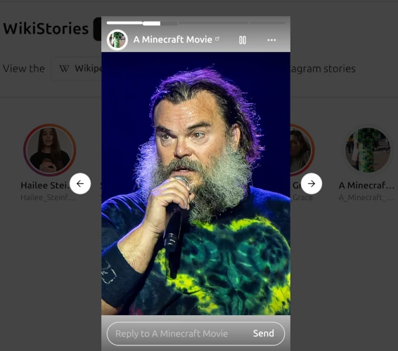

# WikiStories

View the [Wikipedia Top 25](https://en.wikipedia.org/wiki/Wikipedia:Top_25_Report) most viewed articles as Instagram stories

<div style="text-align: center;">
    
</div>


## References:

- https://github.com/vercel/nextgram

- https://gradient.page/ui-gradients/instagram

## Running Yourself

First, run the development server:

```bash
npm run dev
```
Open [http://localhost:3000](http://localhost:3000) with your browser to see the result.